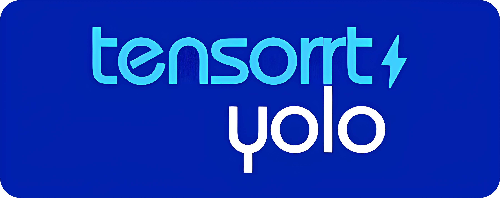
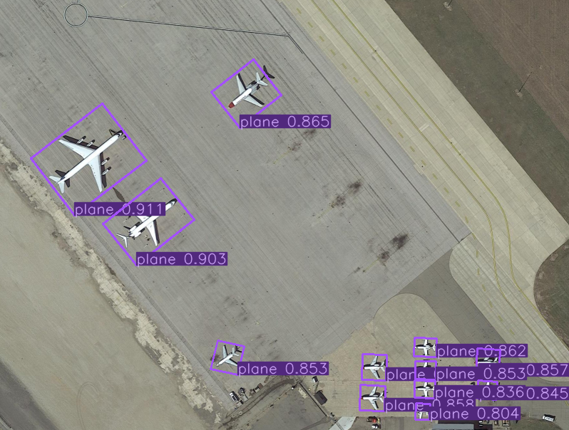
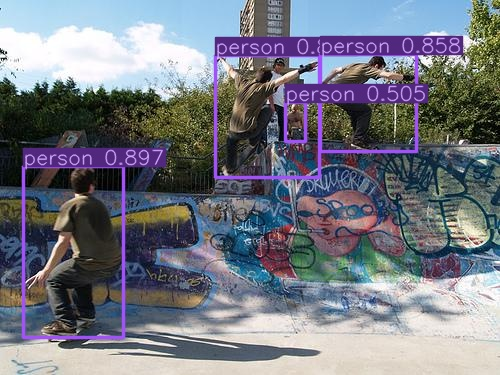
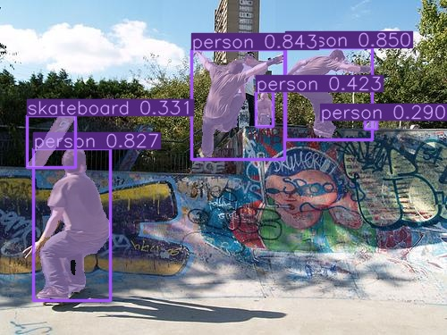
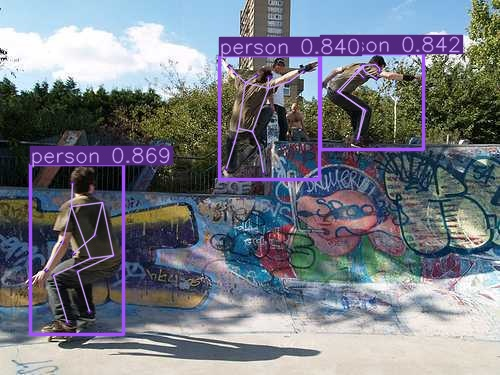
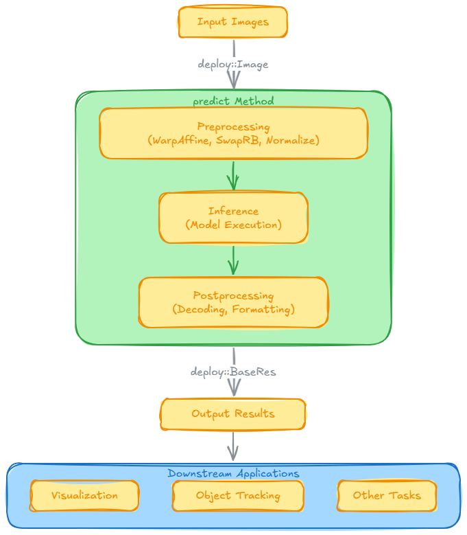
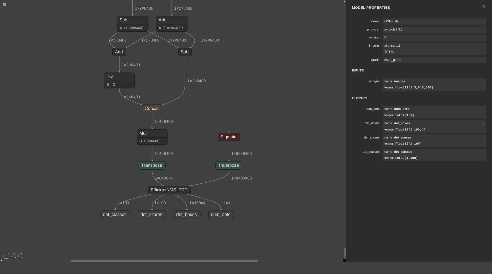
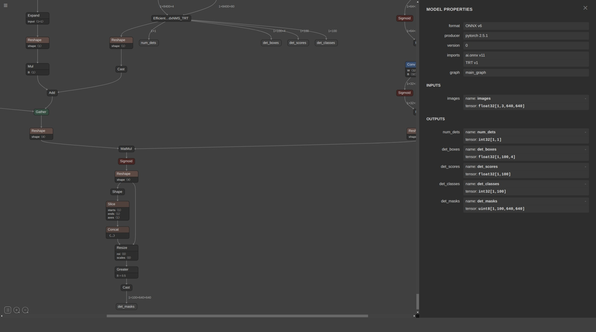
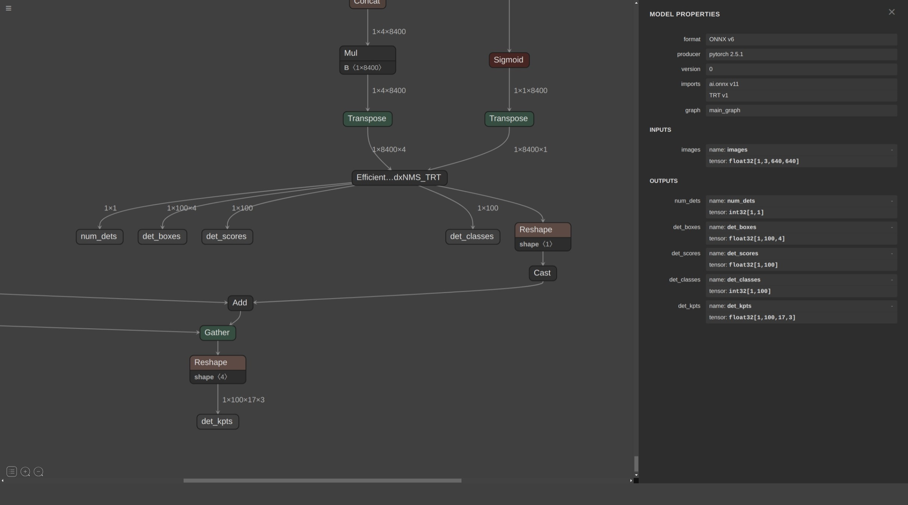
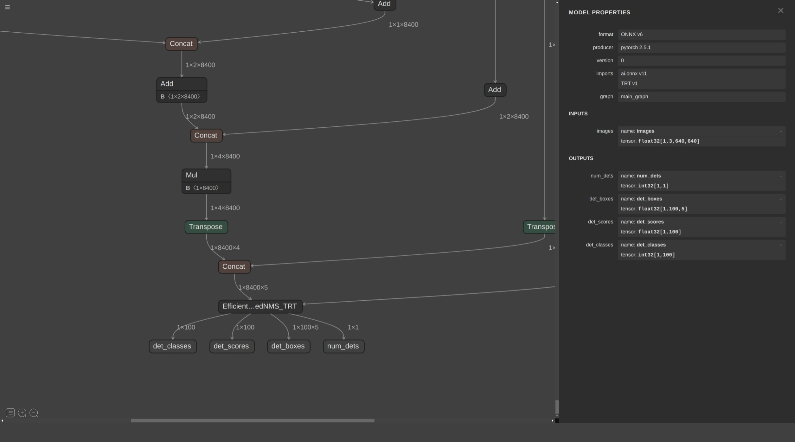

English | [简体中文](README.md)

<div align="center">
  
  
  <p align="center">
      <a href="./LICENSE"></a>
      <a href="https://github.com/laugh12321/TensorRT-YOLO/releases"></a>
      
      
      
      
  </p>

  <p align="center">
      <a href="/docs/en/build_and_install.md"></a>
      <a href="/examples/"></a>
      <a href="#quick-start"></a>
      <a href=""></a>
      <a href="https://github.com/laugh12321/TensorRT-YOLO/releases"></a>
  </p>

</div>

---

🚀 TensorRT-YOLO is an **easy-to-use**, **extremely efficient** inference deployment tool for the **YOLO series** designed specifically for NVIDIA devices. The project not only integrates TensorRT plugins to enhance post-processing but also utilizes CUDA kernels and CUDA graphs to accelerate inference. TensorRT-YOLO provides support for both C++ and Python inference, aiming to deliver a 📦**out-of-the-box** deployment experience. It covers various task scenarios such as [object detection](examples/detect/), [instance segmentation](examples/segment/), [image classification](examples/classify/), [pose estimation](examples/pose/), [oriented object detection](examples/obb/), and [video analysis](examples/VideoPipe), meeting developers' deployment needs in **multiple scenarios**.

<div align="center">

[](examples/obb/)
[](examples/detect/)
[](examples/segment/)
[](examples/pose/)
[](examples/videopipe)

</div>

## <div align="center">🌠 Recent updates</div>

- [Performance Leap! TensorRT-YOLO 6.0: Comprehensive Upgrade Analysis and Practical Guide](https://medium.com/@laugh12321/performance-leap-tensorrt-yolo-6-0-comprehensive-upgrade-analysis-and-practical-guide-9d19ad3b53f9) 🌟 NEW

## <div align="center">✨ Key Features</div>

### 🎯 Diverse YOLO Support
- **Comprehensive Compatibility**: Supports YOLOv3 to YOLOv11 series models, as well as PP-YOLOE and PP-YOLOE+, meeting diverse needs.
- **Flexible Switching**: Provides simple and easy-to-use interfaces for quick switching between different YOLO versions. 🌟 NEW
- **Multi-Scenario Applications**: Offers rich example codes covering [Detect](examples/detect/), [Segment](examples/segment/), [Classify](examples/classify/), [Pose](examples/pose/), [OBB](examples/obb/), and more.

### 🚀 Performance Optimization
- **CUDA Acceleration**: Optimizes pre-processing through CUDA kernels and accelerates inference using CUDA graphs.
- **TensorRT Integration**: Deeply integrates TensorRT plugins to significantly speed up post-processing and improve overall inference efficiency.
- **Multi-Context Inference**: Supports multi-context parallel inference to maximize hardware resource utilization. 🌟 NEW
- **Memory Management Optimization**: Adapts multi-architecture memory optimization strategies (e.g., Zero Copy mode for Jetson) to enhance memory efficiency. 🌟 NEW

### 🛠️ Usability
- **Out-of-the-Box**: Provides comprehensive C++ and Python inference support to meet different developers' needs.
- **CLI Tools**: Built-in command-line tools for quick model export and inference, improving development efficiency.
- **Docker Support**: Offers one-click Docker deployment solutions to simplify environment configuration and deployment processes.
- **No Third-Party Dependencies**: All functionalities are implemented using standard libraries, eliminating the need for additional dependencies and simplifying deployment.
- **Easy Deployment**: Provides dynamic library compilation support for easy calling and deployment.

### 🌐 Compatibility
- **Multi-Platform Support**: Fully compatible with various operating systems and hardware platforms, including Windows, Linux, ARM, and x86.
- **TensorRT Compatibility**: Perfectly adapts to TensorRT 10.x versions, ensuring seamless integration with the latest technology ecosystem.

### 🔧 Flexible Configuration
- **Customizable Preprocessing Parameters**: Supports flexible configuration of various preprocessing parameters, including **channel swapping (SwapRB)**, **normalization parameters**, and **border padding**. 🌟 NEW

## <div align="center">🚀 Performance</div>

<div align="center">

| Model | Official + trtexec (ms) | trtyolo + trtexec (ms) | TensorRT-YOLO Inference (ms)|
|:-----:|:-----------------------:|:----------------------:|:---------------------------:|
| YOLOv11n | 1.611 ± 0.061        | 1.428 ± 0.097          | 1.228 ± 0.048               |
| YOLOv11s | 2.055 ± 0.147        | 1.886 ± 0.145          | 1.687 ± 0.047               |
| YOLOv11m | 3.028 ± 0.167        | 2.865 ± 0.235          | 2.691 ± 0.085               |
| YOLOv11l | 3.856 ± 0.287        | 3.682 ± 0.309          | 3.571 ± 0.102               |
| YOLOv11x | 6.377 ± 0.487        | 6.195 ± 0.482          | 6.207 ± 0.231               |

</div>

> [!NOTE]
>
> **Testing Environment**
> - **GPU**: NVIDIA RTX 2080 Ti 22GB
> - **Input Size**: 640×640 pixels
>
> **Testing Tools**
> - **Official**: Using the ONNX model exported by Ultralytics.
> - **trtyolo**: Using the CLI tool (trtyolo) provided by TensorRT-YOLO to export the ONNX model with the EfficientNMS plugin.
> - **trtexec**: Using NVIDIA's `trtexec` tool to build the ONNX model into an engine and perform inference testing.
>   - **Build Command**: `trtexec --onnx=xxx.onnx --saveEngine=xxx.engine --fp16`
>   - **Test Command**: `trtexec --avgRuns=1000 --useSpinWait --loadEngine=xxx.engine`
> - **TensorRT-YOLO Inference**: Using the TensorRT-YOLO framework to measure the latency (including pre-processing, inference, and post-processing) of the engine obtained through the **trtyolo + trtexec** method.

## <div align="center">🔮 Documentation</div>

- **Installation Guide**
    - [📦 Quick Compilation and Installation](docs/en/build_and_install.md)
- **Usage Examples**
    - [Object Detection Example](examples/detect/README.en.md)
    - [Instance Segmentation Example](examples/segment/README.en.md)
    - [Image Classification Example](examples/classify/README.en.md)
    - [Pose Estimation Example](examples/pose/README.en.md)
    - [Oriented Object Detection Example](examples/obb/README.en.md)
    - [📹 Video Analysis Example](examples/VideoPipe/README.en.md)
    - [Multi-threading and Multi-processing Example](examples/mutli_thread/README.en.md) 🌟 NEW
- **API Documentation**
    - Python API Documentation (⚠️ Not Implemented)
    - C++ API Documentation (⚠️ Not Implemented)
- **FAQ**
    - ⚠️ Collecting ...
- **Supported Models List**
    - [🖥️ Supported Models List](#support-models)

## <div align="center">💨 Quick Start</div><div id="quick-start"></div>

### 1. Prerequisites

- **CUDA**: Recommended version ≥ 11.0.1
- **TensorRT**: Recommended version ≥ 8.6.1
- **Operating System**: Linux (x86_64 or arm) (recommended); Windows is also supported

### 2. Installation

- Refer to the [📦 Quick Compilation and Installation](docs/en/build_and_install.md) documentation.

### 3. Model Export

- Refer to the [🔧 Model Export](docs/en/model_export.md) documentation to export an ONNX model suitable for inference in this project and build it into a TensorRT engine.

### 4. Inference Example

> [!NOTE]
>
> `ClassifyModel`, `DetectModel`, `OBBModel`, `SegmentModel`, and `PoseModel` correspond to image classification (Classify), detection (Detect), oriented bounding box (OBB), segmentation (Segment), and pose estimation (Pose) models, respectively.

- Inference using Python:

  ```python
  import cv2
  from tensorrtyolo.infer import InferOption, DetectModel, generatelabels, visualize
  
  def main():
      # -------------------- Initialization --------------------
      # Configure inference settings
      option = InferOption()
      option.enableswaprb()  # Convert OpenCV's default BGR format to RGB
      # Special model configuration example (uncomment for PP-YOLOE series)
      # option.setnormalizeparams([0.485, 0.456, 0.406], [0.229, 0.224, 0.225])
  
      # -------------------- Model Initialization --------------------
      # Load TensorRT engine file (ensure the path is correct)
      # Note: Initial engine loading may take longer due to optimization
      model = DetectModel(engine_path="yolo11n-with-plugin.engine", 
                        option=option)
  
      # -------------------- Data Preprocessing --------------------
      # Load test image (add file existence check)
      inputimg = cv2.imread("testimage.jpg")
      if input_img is None:
          raise FileNotFoundError("Failed to load test image. Check the file path.")
  
      # -------------------- Inference Execution --------------------
      # Perform object detection (returns bounding boxes, confidence scores, and class labels)
      detectionresult = model.predict(inputimg)
      print(f"==> Detection Result: {detection_result}")
  
      # -------------------- Result Visualization --------------------
      # Load class labels (ensure labels.txt matches the model)
      classlabels = generate_labels(labelsfile="labels.txt")
      # Generate visualized result
      visualized_img = visualize(
          image=input_img,
          result=detection_result,
          labels=class_labels,
      )
      cv2.imwrite("visimage.jpg", visualizedimg)
  
      # -------------------- Model Cloning Demo --------------------
      # Clone model instance (for multi-threaded scenarios)
      cloned_model = model.clone()  # Create an independent copy to avoid resource contention
      # Verify cloned model inference consistency
      clonedresult = cloned_model.predict(inputimg)
      print(f"==> Cloned Result: {cloned_result}")
  
  if _name__ == "__main_":
      main()
  ```

- Inference using C++:

  ```cpp
  #include <memory>
  #include <opencv2/opencv.hpp>
  
  // For ease of use, the module uses only CUDA and TensorRT, with the rest implemented in standard libraries
  #include "deploy/model.hpp"  // Contains model inference class definitions
  #include "deploy/option.hpp"  // Contains inference option configuration class definitions
  #include "deploy/result.hpp"  // Contains inference result definitions
  
  int main() {
      try {
          // -------------------- Initialization --------------------
          deploy::InferOption option;
          option.enableSwapRB();  // BGR->RGB conversion
          
          // Special model parameter setup example
          // const std::vector<float> mean{0.485f, 0.456f, 0.406f};
          // const std::vector<float> std{0.229f, 0.224f, 0.225f};
          // option.setNormalizeParams(mean, std);
  
          // -------------------- Model Initialization --------------------
          auto detector = std::make_unique<deploy::DetectModel>(
              "yolo11n-with-plugin.engine",  // Model path
              option                         // Inference settings
          );
  
          // -------------------- Data Loading --------------------
          cv::Mat cvimage = cv::imread("testimage.jpg");
          if (cv_image.empty()) {
              throw std::runtime_error("Failed to load test image.");
          }
          
          // Encapsulate image data (no pixel data copying)
          deploy::Image input_image(
              cv_image.data,     // Pixel data pointer
              cv_image.cols,     // Image width
              cv_image.rows,     // Image height
          );
  
          // -------------------- Inference Execution --------------------
          deploy::DetResult result = detector->predict(input_image);
          std::cout << result << std::endl;
  
          // -------------------- Result Visualization (Example) --------------------
          // Implement visualization logic in actual development, e.g.:
          // cv::Mat visimage = visualize_detections(cvimage, result);
          // cv::imwrite("visresult.jpg", visimage);
  
          // -------------------- Model Cloning Demo --------------------
          auto cloned_detector = detector->clone();  // Create an independent instance
          deploy::DetResult clonedresult = cloned_detector->predict(inputimage);
  
          // Verify result consistency
          std::cout << cloned_result << std::endl;
  
      } catch (const std::exception& e) {
          std::cerr << "Program Exception: " << e.what() << std::endl;
          return EXIT_FAILURE;
      }
      return EXIT_SUCCESS;
  }
  ```

### 5. Inference Flowchart

Below is the flowchart of the `predict` method, which illustrates the complete process from input image to output result:

<div>
  <p>
      </a>
  </p>
</div>

Simply pass the image to be inferred to the `predict` method. The `predict` method will automatically complete preprocessing, model inference, and post-processing internally, and output the inference results. These results can be further applied to downstream tasks (such as visualization, object tracking, etc.).

> For more deployment examples, please refer to the [Model Deployment Examples](examples) section.

## <div align="center">🖥️ Model Support List</div><div id="support-models"></div>

<div align="center">
    <table>
        <tr>
            <td>
                
                <center>Detect</center>
            </td>
            <td>
                
                <center>Segment</center>
            </td>
        </tr>
        <tr>
            <td>
                
                <center>Pose</center>
            </td>
            <td>
                                                
                <center>OBB</center>
            </td>
        </tr>
    </table>
</div>

Symbol legend: (1)  ✅ : Supported; (2) ❔: In progress; (3) ❎ : Not supported; (4) ❎ : Self-implemented export required for inference. <br>

<div style="text-align: center;">
  <table border="1" style="border-collapse: collapse; width: 100%;">
    <tr>
      <th style="text-align: center;">Task Scenario</th>
      <th style="text-align: center;">Model</th>
      <th style="text-align: center;">CLI Export</th>
      <th style="text-align: center;">Inference Deployment</th>
    </tr>
    <tr>
      <td>Detect</td>
      <td><a href="https://github.com/ultralytics/yolov3">ultralytics/yolov3</a></td> 
      <td>✅</td>
      <td>✅</td>
    </tr>
    <tr>
      <td>Detect</td>
      <td><a href="https://github.com/ultralytics/yolov5">ultralytics/yolov5</a></td> 
      <td>✅</td>
      <td>✅</td>
    </tr>
    <tr>
      <td>Detect</td>
      <td><a href="https://github.com/meituan/YOLOv6">meituan/YOLOv6</a></td> 
      <td>❎ Refer to <a href="https://github.com/meituan/YOLOv6/tree/main/deploy/ONNX#tensorrt-backend-tensorrt-version-800">official export tutorial</a></td> 
      <td>✅</td>
    </tr>
    <tr>
      <td>Detect</td>
      <td><a href="https://github.com/WongKinYiu/yolov7">WongKinYiu/yolov7</a></td> 
      <td>❎ Refer to <a href="https://github.com/WongKinYiu/yolov7#export">official export tutorial</a></td> 
      <td>✅</td>
    </tr>
    <tr>
      <td>Detect</td>
      <td><a href="https://github.com/WongKinYiu/yolov9">WongKinYiu/yolov9</a></td> 
      <td>❎ Refer to <a href="https://github.com/WongKinYiu/yolov9/issues/130#issue-2162045461">official export tutorial</a></td> 
      <td>✅</td>
    </tr>
    <tr>
      <td>Detect</td>
      <td><a href="https://github.com/THU-MIG/yolov10">THU-MIG/yolov10</a></td> 
      <td>✅</td>
      <td>✅</td>
    </tr>
    <tr>
      <td>Detect</td>
      <td><a href="https://github.com/ultralytics/ultralytics">ultralytics/ultralytics</a></td> 
      <td>✅</td>
      <td>✅</td>
    </tr>
    <tr>
      <td>Detect</td>
      <td><a href="https://github.com/PaddlePaddle/PaddleDetection">PaddleDetection/PP-YOLOE+</a></td> 
      <td>✅</td>
      <td>✅</td>
    </tr>
    <tr>
      <td>Segment</td>
      <td><a href="https://github.com/ultralytics/yolov3">ultralytics/yolov3</a></td> 
      <td>✅</td>
      <td>✅</td>
    </tr>
    <tr>
      <td>Segment</td>
      <td><a href="https://github.com/ultralytics/yolov5">ultralytics/yolov5</a></td> 
      <td>✅</td>
      <td>✅</td>
    </tr>
    <tr>
      <td>Segment</td>
      <td><a href="https://github.com/meituan/YOLOv6/tree/yolov6-seg">meituan/YOLOv6-seg</a></td> 
      <td>❎ Implement yourself referring to <a href="https://github.com/laugh12321/TensorRT-YOLO/blob/main/tensorrt_yolo/export/head.py">tensorrt_yolo/export/head.py</a></td>
      <td>🟢</td>
    </tr>
    <tr>
      <td>Segment</td>
      <td><a href="https://github.com/WongKinYiu/yolov7">WongKinYiu/yolov7</a></td> 
      <td>❎ Implement yourself referring to <a href="https://github.com/laugh12321/TensorRT-YOLO/blob/main/tensorrt_yolo/export/head.py">tensorrt_yolo/export/head.py</a></td>
      <td>🟢</td>
    </tr>
    <tr>
      <td>Segment</td>
      <td><a href="https://github.com/WongKinYiu/yolov9">WongKinYiu/yolov9</a></td> 
      <td>❎ Implement yourself referring to <a href="https://github.com/laugh12321/TensorRT-YOLO/blob/main/tensorrt_yolo/export/head.py">tensorrt_yolo/export/head.py</a></td>
      <td>🟢</td>
    </tr>
    <tr>
      <td>Segment</td>
      <td><a href="https://github.com/ultralytics/ultralytics">ultralytics/ultralytics</a></td> 
      <td>✅</td>
      <td>✅</td>
    </tr>
    <tr>
      <td>Classify</td>
      <td><a href="https://github.com/ultralytics/yolov3">ultralytics/yolov3</a></td>
      <td>✅</td>
      <td>✅</td>
    </tr>
    <tr>
      <td>Classify</td>
      <td><a href="https://github.com/ultralytics/yolov5">ultralytics/yolov5</a></td>
      <td>✅</td>
      <td>✅</td>
    </tr>
    <tr>
      <td>Classify</td>
      <td><a href="https://github.com/ultralytics/ultralytics">ultralytics/ultralytics</a></td>
      <td>✅</td>
      <td>✅</td>
    </tr>
    <tr>
      <td>Pose</td>
      <td><a href="https://github.com/ultralytics/ultralytics">ultralytics/ultralytics</a></td>
      <td>✅</td>
      <td>✅</td>
    </tr>
    <tr>
      <td>OBB</td>
      <td><a href="https://github.com/ultralytics/ultralytics">ultralytics/ultralytics</a></td>
      <td>✅</td>
      <td>✅</td>
    </tr>
  </table>
</div>

<h2 align="center">🌟 Sponsorship & Support</h2>

Open-source projects thrive on support. If this project has been helpful to you, consider sponsoring the author. Your support is the greatest motivation for continued development!

<div align="center">
  <a href="https://afdian.com/a/laugh12321">
    
  </a>
</div>

---

🙏 **A Heartfelt Thank You to Our Supporters and Sponsors**:

> [!NOTE]
>
> The following is a list of sponsors automatically generated by GitHub Actions, updated daily ✨.

<div align="center">
  <a target="_blank" href="https://afdian.com/a/laugh12321">
    
  </a>
</div>

## <div align="center">📄 License</div>

TensorRT-YOLO is licensed under the **GPL-3.0 License**, an [OSI-approved](https://opensource.org/licenses/) open-source license that is ideal for students and enthusiasts, fostering open collaboration and knowledge sharing. Please refer to the [LICENSE](https://github.com/laugh12321/TensorRT-YOLO/blob/master/LICENSE) file for more details.

Thank you for choosing TensorRT-YOLO; we encourage open collaboration and knowledge sharing, and we hope you comply with the relevant provisions of the open-source license.

## <div align="center">📞 Contact</div>

For bug reports and feature requests regarding TensorRT-YOLO, please visit [GitHub Issues](https://github.com/laugh12321/TensorRT-YOLO/issues)!

## <div align="center">🙏 Thanks</div>

<div align="center">
<a href="https://hellogithub.com/repository/942570b550824b1b9397e4291da3d17c" target="_blank"></a>
</div>
