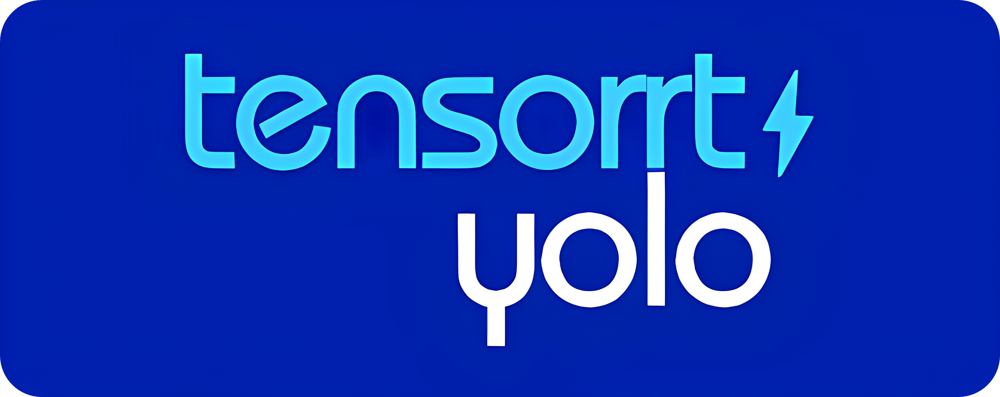
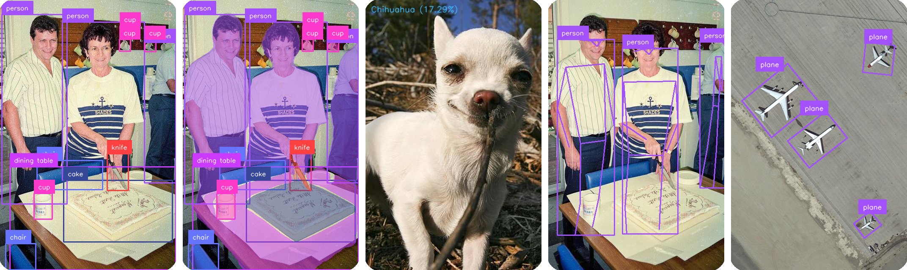
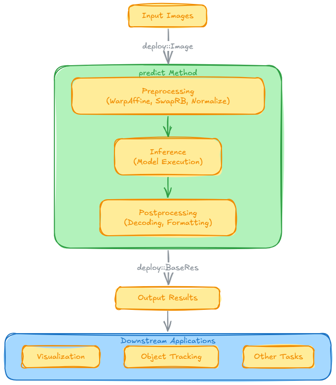

English | [简体中文](README.md)

<div align="center">
  

  <p align="center">
      <a href="./LICENSE"></a>
      <a href="https://github.com/laugh12321/TensorRT-YOLO/releases"></a>
      
      
      
      
  </p>
</div>

---

🚀 TensorRT-YOLO is an **easy-to-use**, **extremely efficient** inference deployment tool for the **YOLO series** designed specifically for NVIDIA devices. The project not only integrates TensorRT plugins to enhance post-processing but also utilizes CUDA kernels and CUDA graphs to accelerate inference. TensorRT-YOLO provides support for both C++ and Python inference, aiming to deliver a 📦**out-of-the-box** deployment experience. It covers various task scenarios such as [object detection](examples/detect/), [instance segmentation](examples/segment/), [image classification](examples/classify/), [pose estimation](examples/pose/), [oriented object detection](examples/obb/), and [video analysis](examples/VideoPipe), meeting developers' deployment needs in **multiple scenarios**.

<div align="center">




</div>

> [!IMPORTANT]
>
> **This repository is the Community Edition (6.4)**, licensed under [GPL-3.0](LICENSE). The community inference API is frozen; no new runtime architecture will be merged here.
>
> **Professional Edition** (closed-source) will be offered separately. Its source is not in this repository. Purchasing is not open yet; this README will be updated when it is. Throughput and capability comparison: [Community vs Professional](#community-vs-professional-edition).

## <div align="center">🌠 Recent updates</div>

- Community Edition (6.4) inference API is frozen; Professional Edition will be offered separately (purchasing is not open yet). 🌟 NEW

- 2026-03-20: Added support for [YOLO26](https://docs.ultralytics.com/models/yolo26/), including classification, oriented bounding boxes, pose estimation, and instance segmentation. 🌟 NEW

- 2026-01-07: Added support for [YOLO-Master](https://github.com/Tencent/YOLO-Master), including classification, oriented bounding boxes, pose estimation, and instance segmentation. 🌟 NEW

- 2025-10-05: Precision perfectly aligned, CUDA flawlessly replicates LetterBox with a pixel error of 0 in the vast majority of cases. The Python module has undergone significant restructuring, greatly enhancing usability. 🌟 NEW

- 2025-06-09: In C++, only a single header file `trtyolo.hpp` is included, with zero third-party dependencies (no need to link CUDA and TensorRT when using the module). Support for data structures with image spacing (Pitch) has been added. For more details, see [Bilibili](https://www.bilibili.com/video/BV1e2N1zjE3L). 🌟 NEW

- 2025-04-19: Added support for [YOLO-World](https://docs.ultralytics.com/zh/models/yolo-world/) and [YOLOE](https://docs.ultralytics.com/zh/models/yoloe/), including classification, oriented bounding boxes, pose estimation, and instance segmentation. See [Bilibili](https://www.bilibili.com/video/BV12N5bzkENV) for details. 🌟 NEW

- 2025-03-29: Added support for [YOLO12](https://github.com/sunsmarterjie/yolov12), including classification, oriented bounding boxes, pose estimation, and instance segmentation. See [issues](https://github.com/sunsmarterjie/yolov12/issues/22) for details. 🌟 NEW

- [Performance Leap! TensorRT-YOLO 6.0: Comprehensive Upgrade Analysis and Practical Guide](https://medium.com/@laugh12321/performance-leap-tensorrt-yolo-6-0-comprehensive-upgrade-analysis-and-practical-guide-9d19ad3b53f9) 🌟 NEW

## <div align="center">✨ Key Features</div>

### 🎯 Diverse YOLO Support
- **Comprehensive Compatibility**: Supports YOLOv3 to YOLO26 series models, as well as YOLO-World and YOLO-Master, meeting diverse needs. See [🖥️ Supported Models List](https://github.com/laugh12321/trtyolo-export/blob/main/README.md#%EF%B8%8F-model-support-list) for details.
- **Flexible Switching**: Provides simple and easy-to-use interfaces for quick switching between different YOLO versions. 🌟 NEW
- **Multi-Scenario Applications**: Offers rich example codes covering [Detect](examples/detect/), [Segment](examples/segment/), [Classify](examples/classify/), [Pose](examples/pose/), [OBB](examples/obb/), and more.

### 🚀 Performance Optimization
- **CUDA Acceleration**: Optimizes pre-processing through CUDA kernels and accelerates inference using CUDA graphs.
- **TensorRT Integration**: Deeply integrates TensorRT plugins to significantly speed up post-processing and improve overall inference efficiency.
- **Multi-Context Inference**: Supports multi-context parallel inference to maximize hardware resource utilization. 🌟 NEW
- **Memory Management Optimization**: Adapts multi-architecture memory optimization strategies (e.g., Zero Copy mode for Jetson) to enhance memory efficiency. 🌟 NEW

### 🛠️ Usability
- **Out-of-the-Box**: Provides comprehensive C++ and Python inference support to meet different developers' needs.
- **CLI Tools**: A concise and intuitive command-line interface with automatic model structure detection, no complex configuration required.
- **Docker Support**: Offers one-click Docker deployment solutions to simplify environment configuration and deployment processes.
- **No Third-Party Dependencies**: All functionalities are implemented using standard libraries, eliminating the need for additional dependencies and simplifying deployment.
- **Easy Deployment**: Provides dynamic library compilation support for easy calling and deployment.

### 🌐 Compatibility
- **Multi-Platform Support**: Fully compatible with various operating systems and hardware platforms, including Windows, Linux, ARM, and x86.
- **TensorRT Compatibility**: Perfectly adapts to TensorRT 10.x versions, ensuring seamless integration with the latest technology ecosystem.

### 🔧 Flexible Configuration
- **Customizable Preprocessing Parameters**: Supports flexible configuration of various preprocessing parameters, including **channel swapping (SwapRB)**, **normalization parameters**, and **border padding**. 🌟 NEW

## <div align="center">💨 Quick Start</div>

### 1. Prerequisites

- **CUDA**: Recommended version ≥ 11.0.1
- **TensorRT**: Recommended version ≥ 8.6.1
- **Operating System**: Linux (x86_64 or arm) (recommended); Windows is also supported

> [!NOTE]  
> If you are developing on Windows, you can refer to the following setup guides:
>
> - [Windows Development Environment Setup – NVIDIA](https://www.cnblogs.com/laugh12321/p/17830096.html)
> - [Windows Development Environment Setup – C++](https://www.cnblogs.com/laugh12321/p/17827624.html)

### 2. Compilation and Installation

First, clone the TensorRT-YOLO repository:

```bash
git clone https://github.com/laugh12321/TensorRT-YOLO
cd TensorRT-YOLO
```

Then compile using CMake with the following steps:

```bash
pip install "pybind11[global]" # Install pybind11 to generate Python bindings
cmake -S . -B build -D TRT_PATH=/your/tensorrt/dir -D BUILD_PYTHON=ON -D CMAKE_INSTALL_PREFIX=/your/tensorrt-yolo/install/dir
cmake --build build -j$(nproc) --config Release --target install
```

After executing the above commands, the `tensorrt-yolo` library will be installed in the specified `CMAKE_INSTALL_PREFIX` directory. The `include` folder will contain the header files, and the `lib` folder will contain the `trtyolo` dynamic library and the `custom_plugins` dynamic library (only needed when building OBB, Segment, or Pose models with `trtexec`). If the `BUILD_PYTHON` option is enabled during compilation, the corresponding Python binding files will also be generated in the `tensorrt_yolo/libs` path.

> [!NOTE]  
> Before using the C++ dynamic library, ensure that the specified `CMAKE_INSTALL_PREFIX` path is added to the environment variables so that CMake's `find_package` can locate the `tensorrt-yolo-config.cmake` file. This can be done using the following command:
>
> ```bash
> export PATH=$PATH:/your/tensorrt-yolo/install/dir # linux
> $env:PATH = "$env:PATH;C:\your\tensorrt-yolo\install\dir;C:\your\tensorrt-yolo\install\dir\bin" # windows
> ```

If you want to experience the same inference speed in Python as in C++, you need to enable the `BUILD_PYTHON` option during compilation, and then follow the steps below:

```bash
pip install --upgrade build
python -m build --wheel
pip install dist/trtyolo-6.*-py3-none-any.whl
```

### 3. Model Convert

- Use the [`trtyolo-export`](https://github.com/laugh12321/trtyolo-export) tool package that comes with the project to convert already-exported YOLO-family ONNX models into TensorRT-YOLO compatible outputs and build it into a TensorRT engine.

### 4. Inference Example

- Inference using Python:

  ```python
  import cv2
  import supervision as sv

  from trtyolo import TRTYOLO

  # -------------------- Initialize the model --------------------
  # Note: The task parameter must match the task type specified during export ("detect", "segment", "classify", "pose", "obb")
  # The profile parameter, when enabled, calculates performance metrics during inference, which can be retrieved by calling model.profile()
  # The swap_rb parameter, when enabled, swaps the channel order before inference (ensuring the model input is RGB)
  model = TRTYOLO("yolo11n-with-plugin.engine", task="detect", profile=True, swap_rb=True)

  # -------------------- Load the test image and perform inference --------------------
  image = cv2.imread("test_image.jpg")
  result = model.predict(image)
  print(f"==> result: {result}")

  # -------------------- Visualize the results --------------------
  box_annotator = sv.BoxAnnotator()
  annotated_frame = box_annotator.annotate(scene=image.copy(), detections=result)

  # -------------------- Performance evaluation --------------------
  throughput, cpu_latency, gpu_latency = model.profile()
  print(throughput)
  print(cpu_latency)
  print(gpu_latency)

  # -------------------- Clone the model --------------------
  # Clone the model instance (suitable for multi-threading scenarios)
  cloned_model = model.clone()  # Create an independent copy to avoid resource contention
  # Verify the consistency of inference with the cloned model
  cloned_result = cloned_model.predict(input_img)
  print(f"==> cloned_result: {cloned_result}")
  ```

- Inference using C++:

  ```cpp
  #include <memory>
  #include <opencv2/opencv.hpp>

  #include "trtyolo.hpp"

  int main() {
      try {
          // -------------------- Initialization --------------------
          trtyolo::InferOption option;
          option.enableSwapRB();  // BGR->RGB conversion

          // Special model parameter setup example
          // const std::vector<float> mean{0.485f, 0.456f, 0.406f};
          // const std::vector<float> std{0.229f, 0.224f, 0.225f};
          // option.setNormalizeParams(mean, std);

          // -------------------- Model Initialization --------------------
          // The models ClassifyModel, DetectModel, OBBModel, SegmentModel, and PoseModel correspond to image classification, detection, oriented bounding box, segmentation, and pose estimation models, respectively.
          auto detector = std::make_unique<trtyolo::DetectModel>(
              "yolo11n-with-plugin.engine",  // Model path
              option                         // Inference settings
          );

          // -------------------- Data Loading --------------------
          cv::Mat cv_image = cv::imread("test_image.jpg");
          if (cv_image.empty()) {
              throw std::runtime_error("Failed to load test image.");
          }

          // Encapsulate image data (no pixel data copying)
          trtyolo::Image input_image(
              cv_image.data,     // Pixel data pointer
              cv_image.cols,     // Image width
              cv_image.rows     // Image height
          );

          // -------------------- Inference Execution --------------------
          trtyolo::DetectRes result = detector->predict(input_image);
          std::cout << result << std::endl;

          // -------------------- Result Visualization (Example) --------------------
          // Implement visualization logic in actual development, e.g.:
          // cv::Mat vis_image = visualize_detections(cv_image, result);
          // cv::imwrite("vis_result.jpg", vis_image);

          // -------------------- Model Cloning Demo --------------------
          auto cloned_detector = detector->clone();  // Create an independent instance
          trtyolo::DetectRes cloned_result = cloned_detector->predict(input_image);

          // Verify result consistency
          std::cout << cloned_result << std::endl;

      } catch (const std::exception& e) {
          std::cerr << "Program Exception: " << e.what() << std::endl;
          return EXIT_FAILURE;
      }
      return EXIT_SUCCESS;
  }
  ```

### 5. Inference Flowchart

Below is the flowchart of the `predict` method, which illustrates the complete process from input image to output result:

<div>
  <p>
      </a>
  </p>
</div>

Simply pass the image to be inferred to the `predict` method. The `predict` method will automatically complete preprocessing, model inference, and post-processing internally, and output the inference results. These results can be further applied to downstream tasks (such as visualization, object tracking, etc.).

> For more deployment examples, please refer to the [Model Deployment Examples](examples) section.

<a id="community-vs-professional-edition"></a>

## <div align="center">⚔️ Community vs Professional Edition</div>

Professional Edition is a rewrite of the Community inference surface, not a small bump. On the same RTX 3080, YOLO11n FP16, batch=1, dummy 640×640 C++ benchmark, Pro wall-clock throughput is higher: Detect **+26.2%**, Segment **+20.1%**. Full comparison: [Pro page](https://trtyolo.laugh12321.cn/pro/).

> Setup: warmup=100, iterations=1000, median of 3 wall-clock runs. Community uses synchronous `predict()`; Pro uses `submit`/`dequeue`, both sync and dual-frame pipeline. Only Detect / Segment were measured. CUDA Graph was on throughout.

### Throughput

| Task | Community (sync) | Pro (sync) | Pro (dual-frame pipeline) | Gain* |
|---|---|---|---|---|
| Detect | 877.7 qps (1.139 ms) | **1022.9 qps (0.978 ms)** | **1107.5 qps (0.903 ms)** | **+26.2%** |
| Segment | 273.1 qps (3.661 ms) | **321.5 qps (3.111 ms)** | **328.1 qps (3.048 ms)** | **+20.1%** |

> \*Gain = Community (sync) → Pro (dual-frame pipeline). Dual-frame pipeline: submit 2 frames, then dequeue and submit in turn so the GPU overlaps consecutive frames; Community has no such API.

### Multi-model Ensemble (Pro only)

| Combo | Community | Pro (sync) | Pro (dual-frame pipeline) |
|---|---|---|---|
| Detect ×2 | N/A | **542.1 qps** | **558.2 qps** |
| Detect + Segment | N/A | **272.9 qps** | **278.8 qps** |
| Segment ×2 | N/A | **172.4 qps** | **176.1 qps** |

> One `Executor::open` loads multiple members with shared pre-process. Community has no ensemble API.

### Capabilities

| | Community | Pro |
|---|---|---|
| Pipeline depth | Synchronous `predict()` only; no `submit`/`dequeue` | Configurable in-flight depth; dual-frame pipeline recommended, Detect +8.3% throughput |
| Multi-model Ensemble | No API | One `Executor::open` loads multiple members with shared pre-process — saves input VRAM |
| Pre-process | OpenCV-aligned; pixel error 0 in most cases, occasionally ±1 | Bit-exact OpenCV match (zero pixel error); LUT-specialized kernels, faster than Community |
| CUDA Graph | First-run capture is included in the report; cannot isolate steady state | Automatic replay; steady-state SetParams skip; GPU timing off-graph |
| Post-process plugin | Detect uses built-in NMS; Pose / Seg / OBB each have a plugin | One plugin covers Detect / Pose / Seg / OBB |
| Multi-session | Opening another session means cloning the instance | Open extra sessions on a loaded model without reloading |
| Public API | `InferOption` plus per-task Model; one `predict` | Load the model once, open many infer sessions; read results per frame |
| Build engine | Pose / Seg / OBB still need the plugin compiled into the engine | Simpler build; Community engines cannot be reused — re-export is required |
| Python task | Must set `task=` to match export | Inferred from the engine by default, overridable |
| TensorRT | ≥ 8.6.1 | **≥ 10** (hard floor) |
| Source and license | Public repo, GPL-3.0 | Closed source, licensed separately |

> Purchasing is not open yet; this README will be updated when it is.

## <div align="center">🌟 Sponsorship & Support</div>

Open-source projects thrive on support. If this project has been helpful to you, consider sponsoring the author. Your support is the greatest motivation for continued development!

<div align="center">
  <a href="https://afdian.com/a/laugh12321">
    
  </a>
</div>

---

🙏 **A Heartfelt Thank You to Our Supporters and Sponsors**:

> [!NOTE]
>
> The following is a list of sponsors automatically generated by GitHub Actions, updated daily ✨.

<div align="center">
  <a target="_blank" href="https://afdian.com/a/laugh12321">
    
  </a>
</div>

## <div align="center">📄 License</div>

TensorRT-YOLO is licensed under the **GPL-3.0 License**, an [OSI-approved](https://opensource.org/licenses/) open-source license that is ideal for students and enthusiasts, fostering open collaboration and knowledge sharing. Please refer to the [LICENSE](https://github.com/laugh12321/TensorRT-YOLO/blob/master/LICENSE) file for more details.

Thank you for choosing TensorRT-YOLO; we encourage open collaboration and knowledge sharing, and we hope you comply with the relevant provisions of the open-source license.

## <div align="center">📞 Contact</div>

For bug reports and feature requests regarding TensorRT-YOLO, please visit [GitHub Issues](https://github.com/laugh12321/TensorRT-YOLO/issues)!

Professional Edition is not open for purchase yet. Please do not ask about pricing in Issues; this README will be updated when purchasing opens.

Giving the project a ⭐ Star helps us prioritize your needs and speed up the response time!

## <div align="center">🙏 Thanks</div>

<div align="center">
<a href="https://hellogithub.com/repository/942570b550824b1b9397e4291da3d17c" target="_blank"></a>
</div>

## <div align="center">🌟 Star History</div>

[](https://www.star-history.com/#laugh12321/TensorRT-YOLO&type=date&legend=top-left)
