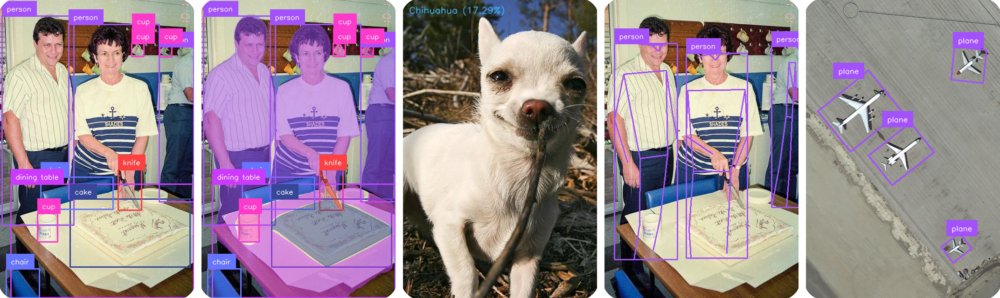

[English](README.en.md) | 简体中文

<div align="center">
  

  <p align="center">
      <a href="./LICENSE"></a>
      <a href="https://github.com/laugh12321/TensorRT-YOLO/releases"></a>
      
      
      
      
  </p>
</div>

---

🚀 TensorRT-YOLO 是一款专为 NVIDIA 设备设计的**易用灵活**、**极致高效**的**YOLO系列**推理部署工具。项目不仅集成了 TensorRT 插件以增强后处理效果，还使用了 CUDA 核函数以及 CUDA 图来加速推理。TensorRT-YOLO 提供了 C++ 和 Python 推理的支持，旨在提供📦**开箱即用**的部署体验。包括 [目标检测](examples/detect/)、[实例分割](examples/segment/)、[图像分类](examples/classify/)、[姿态识别](examples/pose/)、[旋转目标检测](examples/obb/)、[视频分析](examples/VideoPipe)等任务场景，满足开发者**多场景**的部署需求。

<div align="center">




</div>

## <div align="center">🌠 近期更新</div>

- 🔥 **实战课程｜TensorRT × Triton Inference Server 模型部署**
  - **平台**: [BiliBili 课堂](https://www.bilibili.com/cheese/play/ss193350134) | [微信公众号](https://mp.weixin.qq.com/s/DVEo6RB-Wt4yDIX_3u-7Gw) 🚀 **HOT**
  - **团队**: [laugh12321](https://space.bilibili.com/86034462) | [不归牛顿管的熊猫](https://space.bilibili.com/393625476)
  - 🛠 **硬核专题**:  
    ▸ **自定义插件开发**（含Plugin注册全流程）  
    ▸ **CUDA Graph 原理与工程实践**  
    ▸ **Triton Inference Server 部署技巧**  

- 2025-10-05：精度完美对齐，CUDA 完美复刻 LetterBox，绝大多数情况下像素误差为 0。Python 模块重大重构，易用性大幅提升。🌟 NEW

- 2025-06-09: C++仅引单头文件 `trtyolo.hpp`，零第三方依赖（使用模块时无需链接 CUDA 和 TensorRT），增加对带图像间距（Pitch）数据结构的支持，详见 [B站](https://www.bilibili.com/video/BV1e2N1zjE3L)。🌟 NEW

- 2025-04-19: 添加对 [YOLO-World](https://docs.ultralytics.com/zh/models/yolo-world/),  [YOLOE](https://docs.ultralytics.com/zh/models/yoloe/) 的支持，包括分类、定向边界框、姿态估计以及实例分割，详见 [B站](https://www.bilibili.com/video/BV12N5bzkENV)。🌟 NEW

- 2025-03-29: 添加对 [YOLO12](https://github.com/sunsmarterjie/yolov12) 的支持，包括分类、定向边界框、姿态估计以及实例分割，详见 [issues](https://github.com/sunsmarterjie/yolov12/issues/22)。🌟 NEW

- [性能飞跃！TensorRT-YOLO 6.0 全面升级解析与实战指南](https://www.cnblogs.com/laugh12321/p/18693017) 🌟 NEW


## <div align="center">✨ 主要特性</div>

### 🎯 多样化的 YOLO 支持
- **全面兼容**：支持 YOLOv3 至 YOLO12 全系列模型，以及 PP-YOLOE、PP-YOLOE+、YOLO-World 和 YOLOE 等多种变体，满足多样化需求，详见 [🖥️ 模型支持列表](#support-models)。
- **灵活切换**：提供简洁易用的接口，支持不同版本 YOLO 模型的快速切换。🌟 NEW
- **多场景应用**：提供丰富的示例代码，涵盖[Detect](examples/detect/)、[Segment](examples/segment/)、[Classify](examples/classify/)、[Pose](examples/pose/)、[OBB](examples/obb/)等多种应用场景。

### 🚀 性能优化
- **CUDA 加速**：通过 CUDA 核函数优化前处理流程，并采用 CUDA 图技术加速推理过程。
- **TensorRT 集成**：深度集成 TensorRT 插件，显著加速后处理，提升整体推理效率。
- **多 Context 推理**：支持多 Context 并行推理，最大化硬件资源利用率。🌟 NEW
- **显存管理优化**：适配多架构显存优化策略（如 Jetson 的 Zero Copy 模式），提升显存效率。🌟 NEW

### 🛠️ 易用性
- **开箱即用**：提供全面的 C++ 和 Python 推理支持，满足不同开发者需求。
- **CLI 工具**：内置命令行工具，支持快速模型导出与推理，提升开发效率。
- **Docker 支持**：提供 Docker 一键部署方案，简化环境配置与部署流程。
- **无第三方依赖**：全部功能使用标准库实现，无需额外依赖，简化部署流程。
- **部署便捷**：提供动态库编译支持，方便调用和部署。

### 🌐 兼容性
- **多平台支持**：全面兼容 Windows、Linux、ARM、x86 等多种操作系统与硬件平台。
- **TensorRT 兼容**：完美适配 TensorRT 10.x 版本，确保与最新技术生态无缝衔接。

### 🔧 灵活配置
- **预处理参数自定义**：支持多种预处理参数灵活配置，包括 **通道交换 (SwapRB)**、**归一化参数**、**边界值填充**。🌟 NEW

## <div align="center">💨 快速开始</div>

### 1. 前置依赖

- **CUDA**：推荐版本 ≥ 11.0.1
- **TensorRT**：推荐版本 ≥ 8.6.1
- **操作系统**：Linux (x86_64 或 arm)（推荐）；Windows 亦可支持

> [!NOTE]  
> 如果您在 Windows 下进行开发，可以参考以下配置指南：
>
> - [Windows 开发环境配置——NVIDIA 篇](https://www.cnblogs.com/laugh12321/p/17830096.html)
> - [Windows 开发环境配置——C++ 篇](https://www.cnblogs.com/laugh12321/p/17827624.html)

### 2. 编译安装

首先，克隆 TensorRT-YOLO 仓库：

```bash
git clone https://github.com/laugh12321/TensorRT-YOLO
cd TensorRT-YOLO
```

然后使用 CMake，可以按照以下步骤操作：

```bash
pip install "pybind11[global]" # 安装 pybind11，用于生成 Python 绑定
cmake -S . -B build -D TRT_PATH=/your/tensorrt/dir -D BUILD_PYTHON=ON -D CMAKE_INSTALL_PREFIX=/your/tensorrt-yolo/install/dir
cmake --build build -j$(nproc) --config Release --target install
```

执行上述指令后，`tensorrt-yolo` 库将被安装到指定的 `CMAKE_INSTALL_PREFIX` 路径中。其中，`include` 文件夹中包含头文件，`lib` 文件夹中包含 `trtyolo` 动态库和 `custom_plugins` 动态库（仅在使用 `trtexec` 构建 OBB、Segment 或 Pose 模型时需要）。如果在编译时启用了 `BUILD_PYTHON` 选项，则还会在 `trtyolo/libs` 路径下生成相应的 Python 绑定文件。

> [!NOTE]  
> 在使用 C++ 动态库之前，请确保将指定的 `CMAKE_INSTALL_PREFIX` 路径添加到环境变量中，以便 CMake 的 `find_package` 能够找到 `tensorrt-yolo-config.cmake` 文件。可以通过以下命令完成此操作：
>
> ```bash
> export PATH=$PATH:/your/tensorrt-yolo/install/dir # linux
> $env:PATH = "$env:PATH;C:\your\tensorrt-yolo\install\dir;C:\your\tensorrt-yolo\install\dir\bin" # windows
> ```

如果您希望在 Python 上体验与 C++ 相同的推理速度，则编译时需开启 `BUILD_PYTHON` 选项，然后再按照以下步骤操作：

```bash
pip install --upgrade build
python -m build --wheel
pip install dist/trtyolo-6.*-py3-none-any.whl
```

### 3. 模型导出

- 使用项目配套的 [`trtyolo-export`](https://github.com/laugh12321/TensorRT-YOLO/tree/export) 工具包，导出适用于该项目推理的 ONNX 模型并构建为 TensorRT 引擎。

### 4. 推理示例

- 使用 Python 进行推理：

  ```python
  import cv2
  import supervision as sv

  from trtyolo import TRTYOLO

  # -------------------- 初始化模型 --------------------
  # 注意：task参数需与导出时指定的任务类型一致（"detect"、"segment"、"classify"、"pose"、"obb"）
  # profile参数开启后，会在推理时计算性能指标，调用 model.profile() 可获取
  # swap_rb参数开启后，会在推理前交换通道顺序（确保模型输入时RGB）
  model = TRTYOLO("yolo11n-with-plugin.engine", task="detect", profile=True, swap_rb=True)

  # -------------------- 加载测试图片并推理 --------------------
  image = cv2.imread("test_image.jpg")
  result = model.predict(image)
  print(f"==> result: {result}")

  # -------------------- 可视化结果 --------------------
  box_annotator = sv.BoxAnnotator()
  annotated_frame = box_annotator.annotate(scene=image.copy(), detections=result)

  # -------------------- 性能评估 --------------------
  throughput, cpu_latency, gpu_latency = model.profile()
  print(throughput)
  print(cpu_latency)
  print(gpu_latency)

  # -------------------- 克隆模型 --------------------
  # 克隆模型实例（适用于多线程场景）
  cloned_model = model.clone()  # 创建独立副本，避免资源竞争
  # 验证克隆模型推理一致性
  cloned_result = cloned_model.predict(input_img)
  print(f"==> cloned_result: {cloned_result}")
  ```

- 使用 C++ 进行推理：

  ```cpp
  #include <memory>
  #include <opencv2/opencv.hpp>

  #include "trtyolo.hpp"

  int main() {
      try {
          // -------------------- 初始化配置 --------------------
          trtyolo::InferOption option;
          option.enableSwapRB();  // BGR->RGB转换

          // 特殊模型参数设置示例
          // const std::vector<float> mean{0.485f, 0.456f, 0.406f};
          // const std::vector<float> std{0.229f, 0.224f, 0.225f};
          // option.setNormalizeParams(mean, std);

          // -------------------- 模型初始化 --------------------
          // ClassifyModel、DetectModel、OBBModel、SegmentModel 和 PoseModel 分别对应于图像分类、检测、方向边界框、分割和姿态估计模型
          auto detector = std::make_unique<trtyolo::DetectModel>(
              "yolo11n-with-plugin.engine",  // 模型路径
              option                         // 推理设置
          );

          // -------------------- 数据加载 --------------------
          cv::Mat cv_image = cv::imread("test_image.jpg");
          if (cv_image.empty()) {
              throw std::runtime_error("无法加载测试图片");
          }

          // 封装图像数据（不复制像素数据）
          trtyolo::Image input_image(
              cv_image.data,     // 像素数据指针
              cv_image.cols,     // 图像宽度
              cv_image.rows     // 图像高度
          );

          // -------------------- 执行推理 --------------------
          trtyolo::DetectRes result = detector->predict(input_image);
          std::cout << result << std::endl;

          // -------------------- 结果可视化（示意） --------------------
          // 实际开发需实现可视化逻辑，示例：
          // cv::Mat vis_image = visualize_detections(cv_image, result);
          // cv::imwrite("vis_result.jpg", vis_image);

          // -------------------- 模型克隆演示 --------------------
          auto cloned_detector = detector->clone();  // 创建独立实例
          trtyolo::DetectRes cloned_result = cloned_detector->predict(input_image);

          // 验证结果一致性
          std::cout << cloned_result << std::endl;

      } catch (const std::exception& e) {
          std::cerr << "程序异常: " << e.what() << std::endl;
          return EXIT_FAILURE;
      }
      return EXIT_SUCCESS;
  }
  ```

### 5.推理流程图

以下是`predict`方法的流程图，展示了从输入图片到输出结果的完整流程：

<div>
  <p>
      </a>
  </p>
</div>

只需将待推理的图片传递给 `predict` 方法，`predict` 内部会自动完成预处理、模型推理和后处理，并输出推理结果，这些结果可进一步应用于下游任务（如可视化、目标跟踪等）。


> 更多部署案例请参考[模型部署示例](examples) .

## <div align="center">🌟 赞助与支持</div>

开源不易，如果本项目对你有所帮助，欢迎通过赞助支持作者。你的支持是开发者持续维护的最大动力！

<div align="center">
  <a href="https://afdian.com/a/laugh12321">
    
  </a>
</div>

---

🙏 **衷心感谢以下支持者与赞助商的无私支持**：

> [!NOTE]
>
> 以下是 GitHub Actions 自动生成的赞助者列表，每日更新 ✨。

<div align="center">
  <a target="_blank" href="https://afdian.com/a/laugh12321">
    
  </a>
</div>

## <div align="center">📄 许可证</div>

TensorRT-YOLO采用 **GPL-3.0许可证**，这个[OSI 批准](https://opensource.org/licenses/)的开源许可证非常适合学生和爱好者，可以推动开放的协作和知识分享。请查看[LICENSE](https://github.com/laugh12321/TensorRT-YOLO/blob/master/LICENSE) 文件以了解更多细节。

感谢您选择使用 TensorRT-YOLO，我们鼓励开放的协作和知识分享，同时也希望您遵守开源许可的相关规定。

## <div align="center">📞 联系方式</div>

对于 TensorRT-YOLO 的错误报告和功能请求，请访问 [GitHub Issues](https://github.com/laugh12321/TensorRT-YOLO/issues)！

给项目点亮 ⭐ Star 可以帮助我们优先关注你的需求，加快响应速度～

## <div align="center">🙏 致谢</div>

<div align="center">
<a href="https://hellogithub.com/repository/942570b550824b1b9397e4291da3d17c" target="_blank"></a>
</div>

## <div align="center">🌟 Star History</div>

[](https://www.star-history.com/#laugh12321/TensorRT-YOLO&type=date&legend=top-left)
