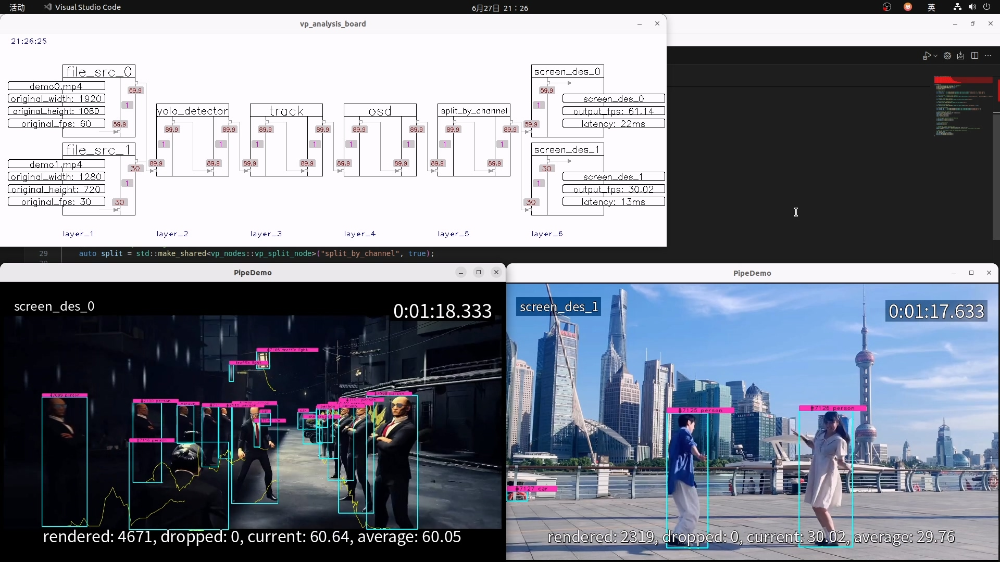

[English](README.en.md) | 简体中文

# 视频分析示例

本示例以 YOLOv8s 模型为例，演示如何将 TensorRT-YOLO 的 Deploy 模块集成到 [VideoPipe](https://github.com/sherlockchou86/VideoPipe) 中进行视频分析。

## 模型导出

首先，从 [YOLOv8s](https://github.com/ultralytics/assets/releases/download/v8.2.0/yolov8s.pt) 下载 YOLOv8s 模型并保存到 `workspace` 文件夹中。

然后，使用以下指令将模型导出为带有 [EfficientNMS](https://github.com/NVIDIA/TensorRT/tree/main/plugin/efficientNMSPlugin) 插件的 ONNX 格式：

```bash
cd workspace
trtyolo export -w yolov8s.pt -v yolov8 -o models -b 2
```

执行以上命令后，将在 `models` 文件夹下生成名为 `yolov8s.onnx` 的文件。接着，使用 `trtexec` 工具将 ONNX 文件转换为 TensorRT engine：

```bash
cd workspace
trtexec --onnx=yolov8s.onnx --saveEngine=yolov8s.engine --fp16
```

## 项目运行

在进行推理之前，请确保已经编译了 VideoPipe 和 TensorRT-YOLO。

接下来，使用 xmake 将项目编译为可执行文件：

```bash
xmake f -P . --tensorrt=/path/to/your/TensorRT --deploy=/path/to/your/TensorRT-YOLO --videopipe=/path/to/your/VideoPipe

xmake -P . -r
```

编译成功后，您可以直接运行生成的可执行文件或使用 `xmake run` 命令进行推理：

```bash
xmake run -P . PipeDemo
```

<div align="center">
    <p>
        
    </p>
</div>

以上是进行模型推理的方法示例。
