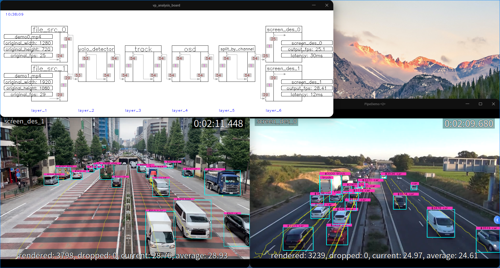

English | [简体中文](README.md)

# Video Analysis Example

This example uses the YOLO11n model to demonstrate how to integrate the TensorRT-YOLO Deploy module into [VideoPipe](https://github.com/sherlockchou86/VideoPipe) for video analysis.

[yolo11n.pt](https://github.com/ultralytics/assets/releases/download/v8.3.0/yolo11n.pt)，[demo0.mp4](https://www.ilanzou.com/s/yhUyq8f3)，[demo1.mp4](https://www.ilanzou.com/s/aIhyq8ET)

Please download the required `yolo11n.pt` model file and test video through the provided link, and save both to the `workspace` folder.

## Model Export

Use the following command to export the ONNX format with the [EfficientNMS](https://github.com/NVIDIA/TensorRT/tree/main/plugin/efficientNMSPlugin) plugin. For detailed `trtyolo` CLI export methods, please read [Model Export](../../docs/en/model_export.md):

```bash
trtyolo export -w workspace/yolo11n.pt -v yolo11 -o workspace -b 2 -s
```

After running the above command, a `yolo11n.onnx` file with a `batch_size` of 2 will be generated in the `models` folder. Next, use the `trtexec` tool to convert the ONNX file to a TensorRT engine (fp16):

```bash
trtexec --onnx=workspace/yolo11n.onnx --saveEngine=workspace/yolo11n.engine --fp16
```

## Project Execution

1. Ensure that the project has been compiled according to the [`TensorRT-YOLO` Compilation](../../docs/en/build_and_install.md#tensorrt-yolo-compile).
1. Ensure that the project has been compiled following the instructions for [`TensorRT-YOLO` compilation](../../docs/en/build_and_install.md##tensorrt-yolo-compilation) and [`VideoPipe` compilation and debugging](https://github.com/sherlockchou86/VideoPipe/blob/master/README.md#compilation-and-debugging).

2. Compile the project into an executable:

    ```bash
    # Compile using xmake
    xmake f -P . --tensorrt="/path/to/your/TensorRT" --deploy="/path/to/your/TensorRT-YOLO" --videopipe="/path/to/your/VideoPipe"
    xmake -P . -r

    # Compile using cmake
    mkdir -p build && cd build
    cmake -DTENSORRT_PATH="/path/to/your/TensorRT" -DDEPLOY_PATH="/path/to/your/TensorRT-YOLO" -DVIDEOPIPE_PATH="/path/to/your/VideoPipe" .. 
    cmake --build . -j8 --config Release
    ```

    After compilation, the executable file will be generated in the `workspace` folder of the project root directory.

3. Run the following command for inference:

    ```bash
    cd workspace
    ./PipeDemo
    ```

<div align="center">
    <p>
        
    </p>
</div>
