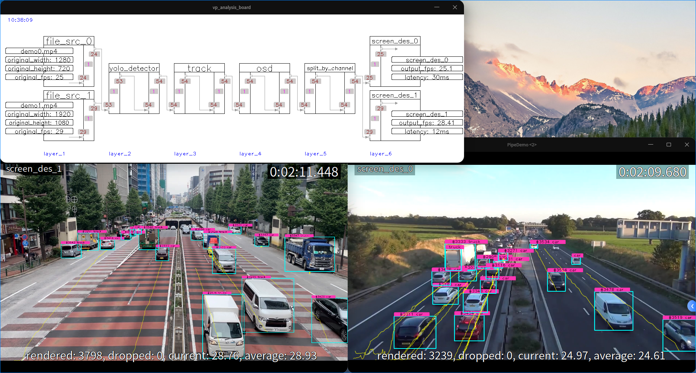

English | [简体中文](README.md)

# Video Analysis Example

This example uses the YOLO11n model to demonstrate how to integrate the TensorRT-YOLO Deploy module into [VideoPipe](https://github.com/sherlockchou86/VideoPipe) for video analysis.

[yolo11n.pt](https://github.com/ultralytics/assets/releases/download/v8.3.0/yolo11n.pt)，[demo0.mp4](https://www.ilanzou.com/s/yhUyq8f3)，[demo1.mp4](https://www.ilanzou.com/s/aIhyq8ET)

Please download the required `yolo11n.pt` model file and test video through the provided link, and save both to the `workspace` folder.

## Model Convert

> [!IMPORTANT]
>
> Please first export the model weights to ONNX, then use the bundled [`trtyolo-export`](https://github.com/laugh12321/trtyolo-export) tool to convert the ONNX model into TensorRT-YOLO compatible outputs and build it into a TensorRT engine.

Use the following commands to export ONNX first and then convert it into the structure required by this project. The converted ONNX will automatically integrate the [EfficientNMS](https://github.com/NVIDIA/TensorRT/tree/main/plugin/efficientNMSPlugin) plugin:

```bash
yolo export model=workspace/yolo11n.pt format=onnx batch=2
trtyolo-export -i workspace/yolo11n.onnx -o workspace/yolo11n-trtyolo.onnx -s
```

After running the commands above, the `workspace` folder will contain the original ONNX file `yolo11n.onnx` and the converted file `yolo11n-trtyolo.onnx`. Next, use `trtexec` to build a TensorRT engine from the converted ONNX file (fp16):

```bash
trtexec --onnx=workspace/yolo11n-trtyolo.onnx --saveEngine=workspace/yolo11n.engine --fp16
```

## Project Execution

1. Make sure that the project has been compiled according to the project documentation and the [`VideoPipe` compilation and debugging](https://github.com/sherlockchou86/VideoPipe/blob/master/README.md#compilation-and-debugging) (only the default five steps need to be executed, without adding any other compilation options).

2. Compile the project into an executable:

    ```bash
    cmake -S . -B build -D VIDEOPIPE_PATH="/path/to/your/VideoPipe"
    cmake --build . -j8 --config Release
    ```

    After compilation, the executable file will be generated in the `workspace` folder of the project root directory.

3. Run the following command for inference:

    ```bash
    cd workspace
    ./PipeDemo
    ```

<div align="center">
    <p>
        
    </p>
</div>
