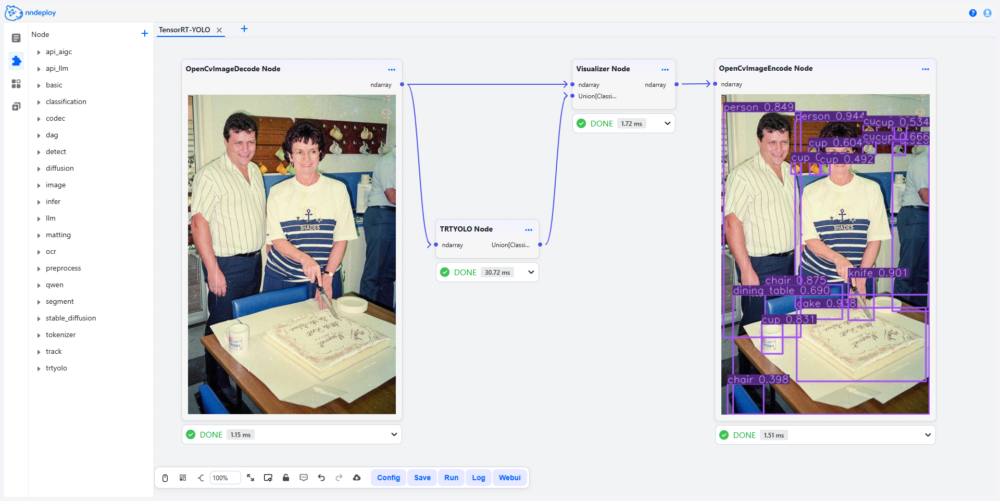
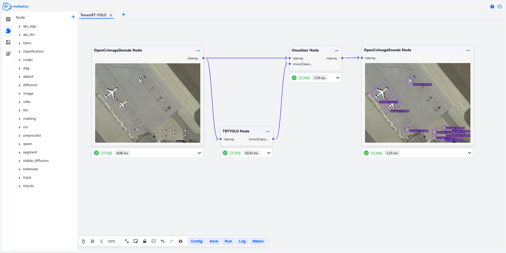
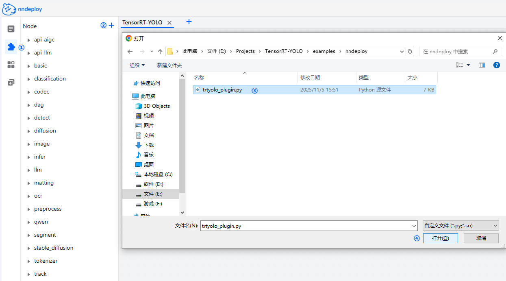

[English](README.en.md) | 简体中文

# 在 nndeploy 工作流中使用 TensorRT-YOLO

本示例简要介绍了如何在 nndeploy 的工作流中使用 [TensorRT-YOLO](https://github.com/laugh12321/TensorRT-YOLO) 工具包实现多类计算机视觉任务，包括**目标检测、实例分割、图像分类、姿态识别及旋转目标检测** 。

    <table>
    <tr>
        <td></td>
        <td></td>
    </tr>
    </table>

## 环境准备

参考 [TensorRT-YOLO 快速编译安装](https://github.com/laugh12321/TensorRT-YOLO/blob/main/docs/cn/build_and_install.md) 文档，执行编译操作与 Python 库打包流程。

> **注意**：编译过程中需确保开启 `BUILD_PYTHON` 选项，随后按照文档步骤完成 Python 库的打包与安装。

## 2. 模型转换

参考 [TensorRT-YOLO 模型导出](https://github.com/laugh12321/TensorRT-YOLO/blob/main/docs/cn/model_export.md) 中的方法，先通过模型 Python 库的命令行工具（CLI）将模型导出为 ONNX 格式，再将 ONNX 模型转换为 TensorRT 引擎。

## 3. 添加自定义节点

    

        
    

1. 在 nndeploy 工作流面板中，点击左侧工具栏的 `Nodes` 栏。

2. 点击 `+` 按钮，导入已下载好的 [`trtyolo_plugin.py`](trtyolo_plugin.py) 文件。

3. 导入成功后刷新页面，可在左侧 `Nodes`（节点）栏中查看该自定义节点。

## 4. 节点参数说明

### nndeploy.trtyolo.TRTYOLO

| 参数名称 | 说明 |
|--------  |------|
| engine_path | TensorRT 引擎文件的路径 |
| model_task | 模型执行的任务类型，可选值为 detect, segment, classify, pose, obb |
| device_id| 用于推理的 GPU 设备 ID |
| swap_rb  | 预处理阶段是否交换图像的 R 通道与 B 通道 |

### nndeploy.trtyolo.Visualizer

| 参数名称 | 说明 |
|--------  |------|
| labels_file | 标签文件（*.txt）的路径，文件内每一行对应一个类别名称 |

